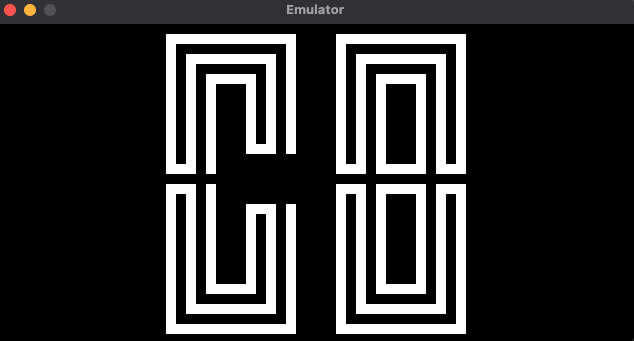
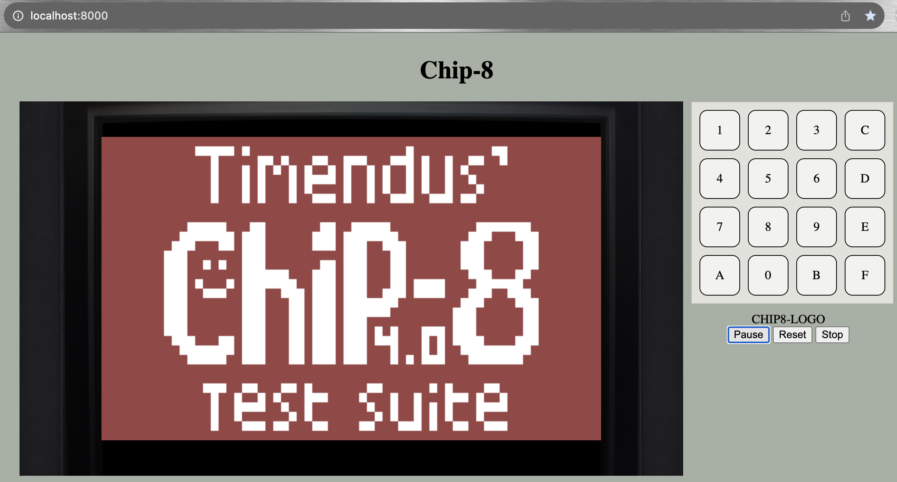
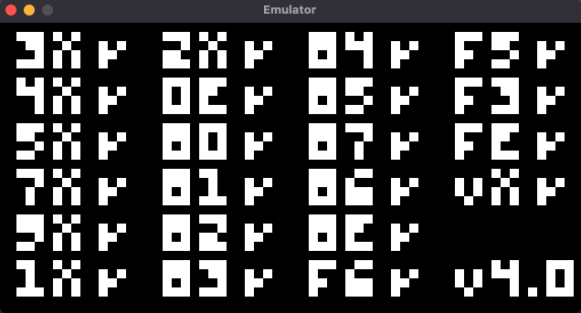

# Emul8tor

Implementation of [CHIP-8](https://en.wikipedia.org/wiki/CHIP-8) virtual machine.

### Structure

The project is made up for the following folder
- [Core](./core/) : The implementation of the  CHIP-8 CPU. This handles the low level command execution and management of the low level components (registers, memory, stack etc.). It exposes an interface for loading ROMs into the CPU, stepping through the execution, and getting the display buffer to render on a screen. The display functionality is decoupled from CPU to allow different video libraries.

- [Desktop](./desktop/): This models a native emulator and it uses SDL for rendering the display. It has `core` as a dependency and it creates a CPU object and peripherals for display and sound.

- [Wasm emulator](./wasm_emulator/): This models a web based emulator and is similar to `desktop` but it creates a canvas context for rendering rather than SDL.

- [Web](./web/): Contains the web components for running the wasm module in a web browser.

- [Roms](./roms/): Contains roms that can be loaded into the emulator.
### Differences between `desktop` and `wasm_emulator`
In desktop, the main type exported is an `Emulator`, this contains a `CPU` and `Peripherals`. The execution logic is contained within the emulator and the call through `start()`. wasm_emulator exposes a a typed called `WasmEmu` which contains a `CPU` and a `Context`.It does not however implement the execution logic, but rather exposes thin abstractions to the `CPU` allowing for the owner of the `WasmEmu` to implemented its own execution loop. This is allows `Javascript` to execute the loop in the browser. 

In desktop, the `tick_timers()` function accepts a reference to a boolean specifying if the sound timer has counted down. This signal that a sound should be played. Due to limitation of which types can be passed in WASM, the wasm_emulator function return and integer value to signal if to play the beep.

### Dependencies

- SDL2 [installations here](https://wiki.libsdl.org/SDL2/Installation)
- wasm-pack [installation instructions here](https://rustwasm.github.io/wasm-pack/installer/)
- python (optional for running local server)

### Building amd Running
To build `core`, perform the following. This will build the library exposing the CPU functionality.

```shell
> cd core
> cargo build
```

To build or run `desktop`

```shell
> cd core
> cargo run <name_of_rom> #run the application 

> cargo build [--release] #
> ./target/<build_type>/desktop_emul8tor <name_of_rom>  #build_type : release, debug
```




To run wasm

```shell
> cd wasm_emulator
> wasm-pack build --target web # this creates ./pkg folder
> mv ./pkg web/pkg
> cd web 
> python -m http.server
```
Once the server is running, navigate to the `http://localhost:8080/`.


### Testing functionalities

Test roms can be found [here](roms/tests/). These roms are from [Chip8 Test Suite](https://github.com/Timendus/chip8-test-suite). Description of the expected behavior is provided in that project.



### Useful References

The below resources were very useful as references.

- [https://aquova.net/](https://aquova.net/chip8/chip8.pdf), this pdf and github project.
- [Chip-8 Design Specification](http://www.cs.columbia.edu/~sedwards/classes/2016/4840-spring/designs/Chip8.pdf)
- [Chip8 Test Suite](https://github.com/Timendus/chip8-test-suite) was great verifying op-code functionality.
